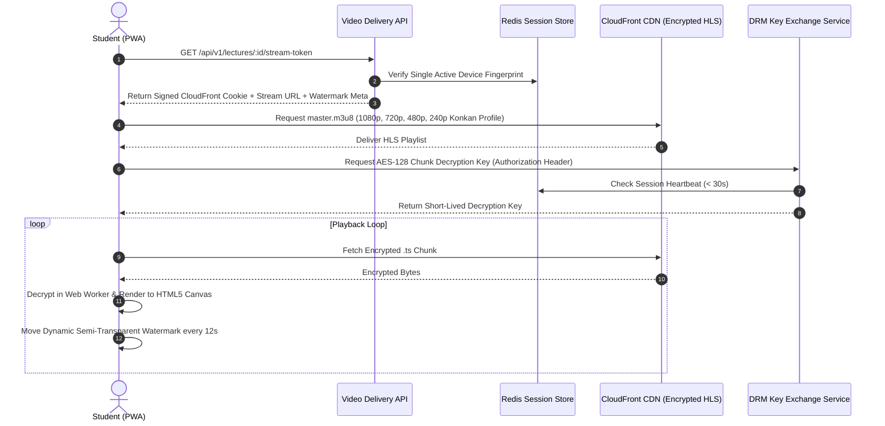
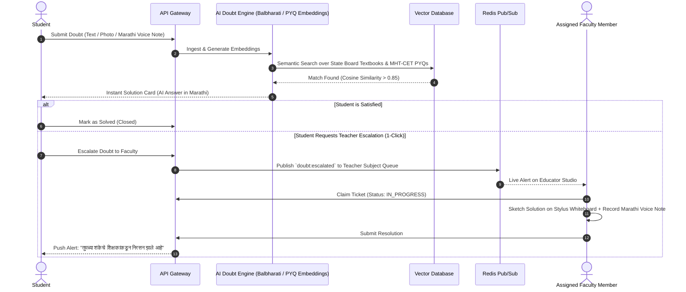

# Technical Architecture & System Design
**Document Version:** 2.0.0 (Brainstormed & Scope-Locked)  
**System Topology:** Modular Backend Services + Progressive Web App + Hybrid Media & AI Pipeline  

---

## 1. High-Level System Architecture

```mermaid
graph TD
    User([End Users: Students / Teachers / Admins on PWA]) --> Cloudflare[Cloudflare CDN & Enterprise WAF / DDoS]
    
    subgraph Edge & Static Distribution
        Cloudflare --> StaticPWA[Vite React PWA / S3 Static Bucket with Service Worker]
        Cloudflare --> MediaCDN[CloudFront CDN - Encrypted HLS Video Segments & Watermarks]
    end

    subgraph API Gateway & Security Perimeter
        Cloudflare --> Gateway[API Gateway / Reverse Proxy - Traefik]
        Gateway --> AuthGuard[JWT & Single-Device Fingerprint Authenticator]
    end

    subgraph Core Application Services
        AuthGuard --> AuthService[Auth & Session Service - Redis Heartbeat]
        AuthGuard --> AcademicService[Academic & Batch Core Service]
        AuthGuard --> AIDoubtService[AI Doubt Resolver - Textbook RAG Engine]
        AuthGuard --> FacultyDoubtService[Teacher Escalation & Whiteboard Hub]
        AuthGuard --> AssessmentService[MHT-CET / Board CBT Exam Engine]
        AuthGuard --> MediaService[Transcoding & DRM Orchestrator]
    end

    subgraph Data, Vector & Storage Layer
        AuthService & AcademicService & AssessmentService --> PG[(PostgreSQL 16 Multi-AZ)]
        AIDoubtService --> PGVector[(pgvector / Vector Knowledge Base)]
        AuthService & FacultyDoubtService --> RedisCluster[(Redis 7 Cluster: Sessions / PubSub / MQ)]
        MediaService --> S3Raw[(S3 Raw Storage)]
        MediaService --> S3Processed[(S3 Encrypted HLS Bucket)]
        MediaService --> MediaConvert[AWS MediaConvert / FFmpeg Transcoder]
    end
```

---

## 2. Media & DRM Playback Sequence (Hybrid Model)



---

## 3. AI-First & Faculty Escalation Doubt Resolution Flow



---

## 4. Single-Device Session Lock Implementation

```
+---------------------------------------------------------------------------------------+
| REDIS SINGLE-SESSION ENFORCEMENT ALGORITHM                                            |
+---------------------------------------------------------------------------------------+
Key Format: `session:active:<user_id>`
Value: JSON {
    "fingerprint": "a4f8c9... (SHA-256 of WebGL + Canvas + Audio + UA)",
    "socket_id": "ws_client_9942",
    "ip": "103.21.12.44",
    "last_heartbeat": 1725004800
}

Logic:
1. On login request:
   - Compute incoming device fingerprint hash.
   - If key exists AND existing fingerprint != incoming fingerprint:
       -> Publish WS event to old socket_id: `FORCE_LOGOUT`
       -> Overwrite key with new fingerprint and new socket_id.
2. Every 30s:
   - Client sends heartbeat `/api/v1/auth/heartbeat`.
   - Redis key TTL refreshed to 90 seconds.
3. If heartbeat is missed (> 90s):
   - Key expires automatically, freeing the seat for subsequent logins.
```
