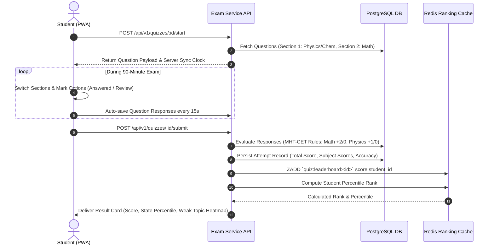

# Data Flow Diagrams (DFD) & Interaction Sequences
**Document Version:** 2.0.0 (Brainstormed & Scope-Locked)  
**System Scope:** DFD Level 0, Level 1, and Level 2 covering MHT-CET/Board LMS, DRM Video with Dynamic Watermark, AI Doubt RAG & Teacher Escalation, and Admin Telemetry  

---

## 1. DFD Level 0: Context Diagram

```mermaid
graph TD
    subgraph External Entities
        Student[Student / Learner (PWA)]
        Teacher[Faculty / Educator (Studio)]
        Admin[Institute Administrator (Hub)]
        AIRAG[AI Textbook & PYQ Engine]
        PaymentGW[Razorpay / Cashfree Gateway]
        CDN[CloudFront Encrypted HLS CDN]
    end

    subgraph Platform Core
        Platform((MahaShiksha Platform Core))
    end

    %% Student Flows
    Student -->|1. Credentials & Device Fingerprint| Platform
    Student -->|2. Doubts (Voice / Image / Text)| Platform
    Student -->|3. MHT-CET CBT Quiz Responses| Platform
    Student -->|4. Batch Purchase (UPI/Card)| PaymentGW
    PaymentGW -->|5. Payment Webhook Confirmation| Platform
    Platform -->|6. Encrypted HLS Streams + Watermark Metadata| Student
    Platform -->|7. Canvas-Rendered Notes & DPPs| Student
    Platform -->|8. Instant Score, Percentile & Rank| Student

    %% Teacher Flows
    Teacher -->|9. Video Lectures & Live Schedules| Platform
    Teacher -->|10. Study Materials & DPP PDFs| Platform
    Teacher -->|11. Whiteboard & Marathi Voice Solutions| Platform
    Platform -->|12. Escalated Doubt Tickets Queue| Teacher

    %% Admin Flows
    Admin -->|13. Batch Pricing, Free Demos & Syllabus Config| Platform
    Admin -->|14. Session Kill Commands & Fraud Bans| Platform
    Platform -->|15. Real-Time Telemetry & SLA Reports| Admin

    %% AI Pipeline
    Platform -->|16. Query Embeddings for Instant Doubt| AIRAG
    AIRAG -->|17. Balbharati & MHT-CET Instant Solutions| Platform
    Platform -->|18. Signed Video Segments| CDN
```

---

## 2. DFD Level 1: Subsystem Data Flow

```mermaid
graph TD
    subgraph Storage & Cache
        DB[(PostgreSQL 16 Multi-AZ)]
        VectorDB[(pgvector - Balbharati Embeddings)]
        Redis[(Redis 7 - Sessions, PubSub, MQ)]
        S3[(AWS S3 Encrypted Media)]
    end

    %% Process 1: Auth & Single-Device
    subgraph P1[1.0 Auth & Device Fingerprint Validator]
        AuthProc[Authenticate & Enforce Single Session]
    end
    Student & Teacher & Admin -->|Login Request + Fingerprint| AuthProc
    AuthProc -->|Check & Invalidate Previous Session| Redis
    AuthProc -->|Verify Credentials & Fetch Role| DB
    AuthProc -->|Issue JWT & Refresh Token| Student & Teacher & Admin

    %% Process 2: Hybrid Video Ingestion & DRM
    subgraph P2[2.0 Video Ingestion & DRM Transcoding]
        VideoProc[Transcode HLS & Generate AES-128 Keys]
    end
    Teacher -->|Upload Raw MP4 Lecture| VideoProc
    VideoProc -->|Store HLS Segments & Manifest| S3
    VideoProc -->|Store Lecture Metadata & Free-Demo Flag| DB

    %% Process 3: AI-First Doubt Resolution
    subgraph P3[3.0 AI-First Doubt Engine & Faculty Escalation]
        DoubtProc[Match AI Knowledge Base / Route to Teacher]
    end
    Student -->|Submit Doubt (Voice / Image / Text)| DoubtProc
    DoubtProc -->|Semantic Search| VectorDB
    DoubtProc -->|If Escalated: Queue to Subject Teacher| Redis
    Redis -->|Live Ticket Alert| Teacher
    Teacher -->|Submit Whiteboard / Voice Solution| DoubtProc
    DoubtProc -->|Persist Resolution| DB
    DoubtProc -->|Real-Time Solution Push| Student

    %% Process 4: MHT-CET CBT Exam Simulator
    subgraph P4[4.0 CBT Exam Arena & DPP Evaluator]
        ExamProc[Simulate MHT-CET Exam & Compute Analytics]
    end
    Teacher -->|Create Question Bank with LaTeX / Marathi| ExamProc
    Student -->|Submit Timed CBT Responses| ExamProc
    ExamProc -->|Store Score & Update Percentile Cache| DB
    ExamProc -->|Deliver Rank & Question Solutions| Student

    %% Process 5: Admin Telemetry & Anti-Piracy
    subgraph P5[5.0 Telemetry & Anti-Piracy Command]
        AdminProc[Aggregate Watch Time & Enforce DRM Bans]
    end
    Student & Teacher -->|Send 30s Heartbeat & Telemetry| AdminProc
    AdminProc -->|Update Live Metrics| Redis
    AdminProc -->|Watermark Forensic Lookup & Device Kill| Redis
    AdminProc -->|Render Live Telemetry Dashboard| Admin
```

---

## 3. DFD Level 2: MHT-CET CBT Quiz & Instant Percentile Sequence


